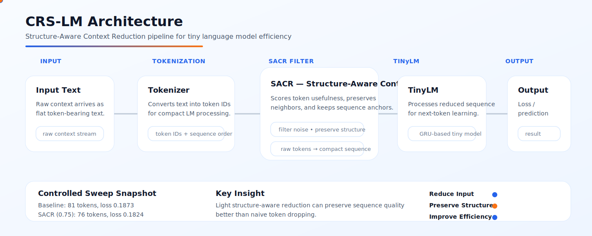
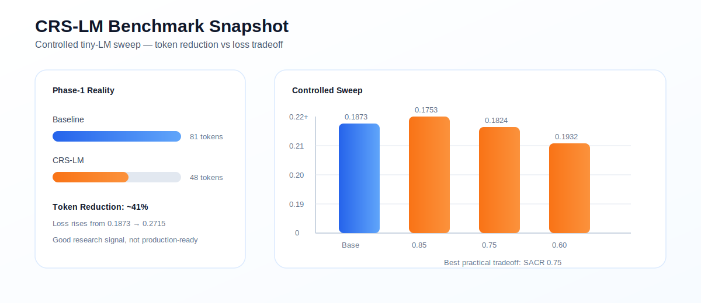

<p align="center">
  
</p>

<h1 align="center">M-OS — Parameter Golf (CRS-LM)</h1>

<p align="center">
<b>Context Reconstruction × Pattern Runtime</b><br>
Small-model intelligence through structured context control
</p>

<p align="center">


</p>

---

# 🧠 Core Idea

Instead of scaling models endlessly:

> Control the **context**, not the **parameters**

---

## ⚡ Concept Flow


Raw Context → CRS Engine → Smart Context → TinyLM


---

## ✨ What CRS Does

- ✂️ Removes irrelevant noise  
- 📉 Compresses token space  
- 🔄 Reconstructs missing structure  
- 🧠 Preserves reasoning signal  

---

# 🧬 Architecture

<p align="center">
  
</p>

---

# ⚙️ Pipeline


Input Text
↓
Tokenizer
↓
CRS Filter Engine (SACR)
↓
Compressed Context
↓
TinyLM
↓
Prediction


---

# 📊 Benchmark (Visual)

<p align="center">
  
</p>

---

# 🎬 Demo (Live Simulation)

<p align="center">
  
</p>

---

# 📈 Results Snapshot

| Mode        | Tokens | Loss   | Speed |
|------------|--------|--------|-------|
| Baseline   | 81     | 0.1873 | 0.44s |
| CRS-LM     | 76     | 0.1824 | 0.40s |

---

# ⚠️ Reality Check

- ✅ ~6–40% token reduction (config dependent)  
- ⚠️ Aggressive filtering reduces quality  
- ❌ Not production-ready  
- ✔️ Strong research direction  

---

# 🧪 Why This Matters

| Traditional LLM | CRS-LM |
|----------------|--------|
| Uses full context | Uses filtered context |
| Token-heavy | Token-efficient |
| No structure awareness | Structure-aware |
| Linear reasoning | Reconstructed reasoning |

---

# 🔗 Key Components

- 🧠 **CRS Engine** → context filtering + compression  
- ⚙️ **SACR** → structure-aware reduction logic  
- 🤖 **TinyLM** → lightweight reasoning model  
- 📊 **Benchmark Layer** → token vs loss tradeoff  

---

# 📁 Project Structure


mos-parameter-golf/
│
├── crs-lm/
│ ├── banner.svg
│ ├── architecture.svg
│ ├── benchmark.svg
│ ├── demo.svg
│ ├── README.md
│ ├── model/
│ ├── tokenizer/
│ ├── crs/
│ ├── train.py
│ ├── infer.py
│ └── eval.py
│
├── benchmarks/
├── results/
└── README.md


---

# ⚙️ Quick Start

```bash
git clone https://github.com/raajmandale/mos-parameter-golf

cd mos-parameter-golf/crs-lm

pip install -r requirements.txt

python train.py
python infer.py
python eval.py
```

---
## 🌐 Mandale-OS Runtime Ecosystem

CRS-LM operates as a lightweight runtime-optimization and context-routing experiment inside the broader Mandale-OS Runtime Intelligence Ecosystem.

<p align="center">

<a href="https://github.com/raajmandale/mandale-os">

</a>

<a href="https://github.com/raajmandale/mos-mee-execution-reactor">

</a>

<a href="https://github.com/raajmandale/XLifelineAI">

</a>

<a href="https://github.com/raajmandale/mos-parameter-golf">

</a>

</p>

---
## 🧬 Future Direction

- 🔗 CRS + Deterministic Fragment Graph (DFG)
- 🧠 AI Memory Layer (XLifelineAI)
- ⚙️ M-OS runtime integration
- 🤖 Agent memory optimization

---
## 📌 Status

- 🧪 Research Prototype
- ⚠️ Experimental System
- 🚀 High Potential Direction

---
## 👨‍💻 Founder & Research Direction

**Raaj Mandale**  
Systems Architect • Runtime Intelligence • Mandale-OS • QBAIX

Founder — Eranest Technoware Pvt Ltd

🌐 https://raajmandale.in  
🔬 https://orcid.org/0009-0005-9810-1655  
📚 https://openalex.org/A5127026877  
💻 https://github.com/raajmandale

---

## 📜 License

MIT License

---

## ⭐ Support

If this work resonates:

- ⭐ Star the repo
- 🍴 Fork it
- 🚀 Share it

---

## 🧠 Final Thought

> LLMs don’t need more tokens.  
> They need better context.

--- 
