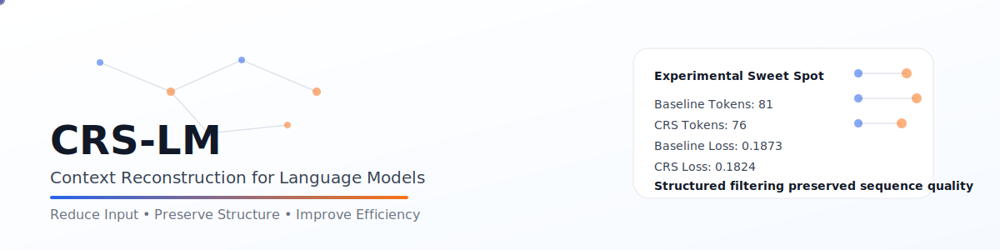

Create or replace the **entire** file with this:

```md
<p align="center">
  
</p>

# CRS-LM  
### Context Reconstruction for Language Models

> A lightweight system for reducing input tokens while preserving sequence quality through structure-aware filtering.

<p align="left">
  
  
  
  
</p>

---

## 🧠 Problem

Small language models often process flat token streams with:

- unnecessary token redundancy  
- weak structure awareness  
- wasted compute on low-signal input  

Under tight constraints, this matters a lot.

---

## ⚡ Idea

CRS-LM explores a simple principle:

> Not all tokens are equally useful.

Instead of only shrinking the model, it tries to improve efficiency by improving what the model sees.

---

## 🧩 Method

CRS-LM currently uses:

# **SACR — Structure-Aware Context Reduction**

SACR is a lightweight preprocessing layer that:

- scores token usefulness  
- keeps high-signal tokens  
- preserves local neighbors  
- maintains sequence continuity  
- reduces low-value redundancy before the LM  

---

## ⚙️ Pipeline

```text
Raw Tokens
   ↓
SACR (Structure-Aware Context Reduction)
   ↓
Compact Sequence
   ↓
TinyLM
   ↓
Prediction / Loss
📊 Controlled sweep
Mode	Keep Ratio	Tokens	Final Tokens	Loss	Time (s)
Baseline	1.00	81	81	0.1873	0.4465
SACR	0.85	81	79	0.1753	0.4194
SACR	0.75	81	76	0.1824	0.4036
SACR	0.60	81	72	0.1932	0.4181
🔥 Key insight

The sweep suggests:

light reduction is viable
aggressive reduction damages learning quality
preserving local structure matters more than naive token dropping
✅ Best practical sweet spot

SACR (0.75)

Why this is the most balanced point right now:

token count reduced from 81 → 76
final loss remained slightly better than baseline in this tiny setup
training time improved slightly

This is not a final claim of superiority.
It is an early signal that structure-aware reduction is worth exploring.

🧪 Experimental claim

This is a controlled small-scale experiment.

It shows early evidence that:

reducing input size does not automatically degrade training
token selection quality matters
structure-preserving filtering is more promising than naive filtering

It does not claim:

state-of-the-art performance
large-scale generalization
final challenge readiness
🚀 Run locally
📦 Install
pip install -r requirements.txt
🧠 Train
python train.py
📊 Compare
python compare.py
📁 Project structure
crs_lm/
├── assets/              # banner.svg
├── crs/                 # SACR filter logic
├── data/                # tiny corpus
├── docs/                # experiment note
├── model/               # tokenizer + TinyLM
├── compare.py
├── train.py
├── requirements.txt
└── README.md
📄 Experiment note

Detailed write-up:

docs/CRS_LM_EXPERIMENT.md
💡 Philosophy

Efficiency is not only about smaller models.
It is also about cleaner input.

🧭 Context

Built under:

mos-parameter-golf → CRS-LM

👤 Author

Raaj Mandale